# AMD 5800H + RX6400 MacOS14 Hackintosh EFI

天宝/天钡小游侠（非天宝/天钡游侠）迷你主机黑苹果EFI，rx6400独显4G，双NVME硬盘，RGB呼吸灯，支持最新版本MacOS。

### 功能
|  功能/设备   | 型号  |是否支持  |
|  ----  | ----  |----  |
| CPU  | AMD Ryzen 7 5800H | 支持 |
| iGPU  | Vega 8(integrated GPU) | 支持 |
| dGPU  | AMD RX6400 4G| 仅加载，无法驱动 |
| 内存  | 16G（8g 3200mhz x2） | 支持 |
| 硬盘1  | 512g NVME | 支持 |
| 硬盘2  | 1T NVME| 支持 |
| 声卡  | -- | 未测试 |
| 麦克风  | -- | 未测试 |
| HDMI/DP 接口  | 连接AMD RX6400独显 | 不支持 |
| TypeC Video 接口  | 连接Vega 8核显 | 支持 |
| 网卡  | AX200 WiFi6 | 支持 |
| 蓝牙  | AX200 5.1 | 支持 |
| 双系统  | win11 + MacOS14 | 支持 |
| USB  | 定制 | 支持 |
| 睡眠  | -- | 不支持 |
### 注意事项
* 默认显存为512M，在BIOS中把显存更改为1G或更高。
* 安装时停用Nootered驱动，进入桌面后再启用（更新时也要停用）。
* 使用黑苹果系统时显示器数据线插在后面板的TypeC口，不要使用HDMI/DP口。
* 如果没有第二块硬盘，把DP中的设备删除
* 关闭拼写纠正
  Settings-Keyboard-Text input-Correct spelling automatically
### 问题
* 偶尔卡顿
* 睡眠睡死
### 配置
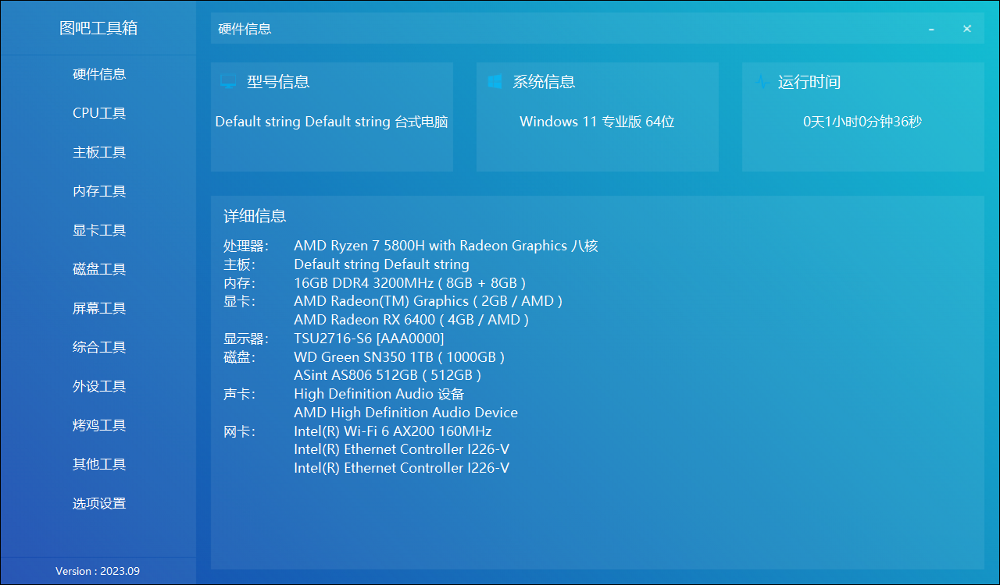
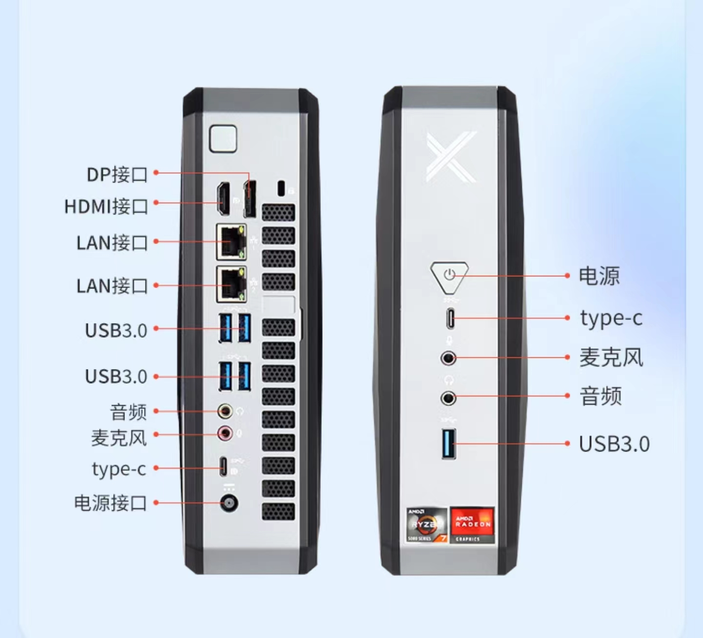

### 关于

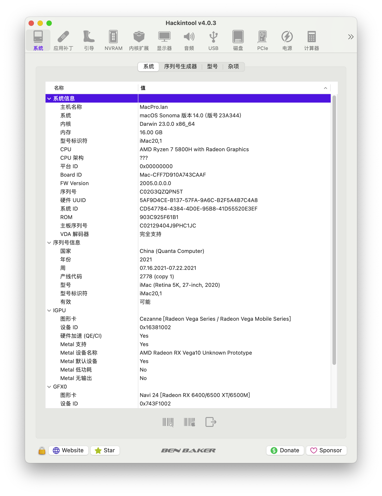
### PCIE设备
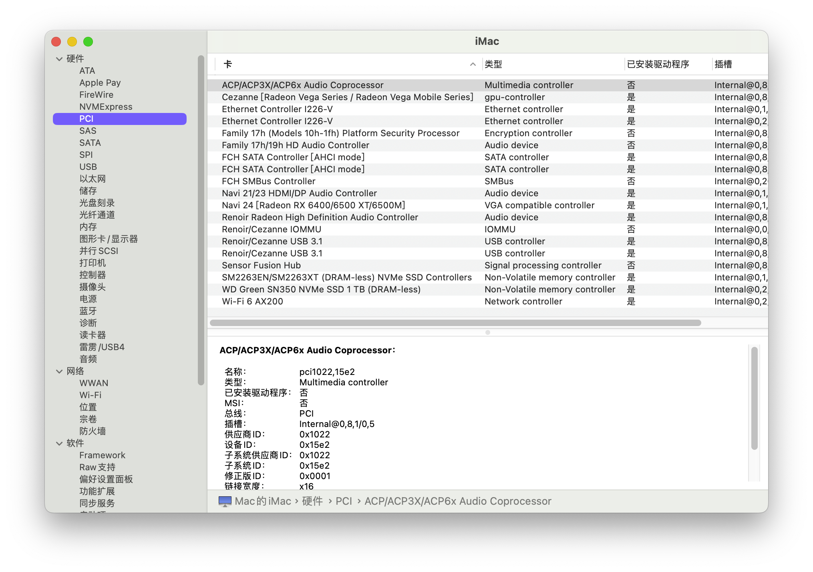
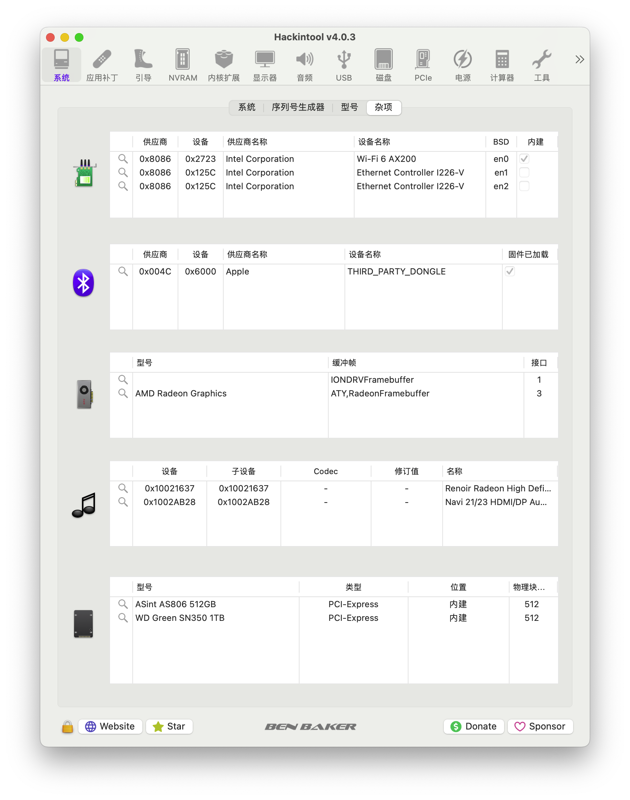

### USB
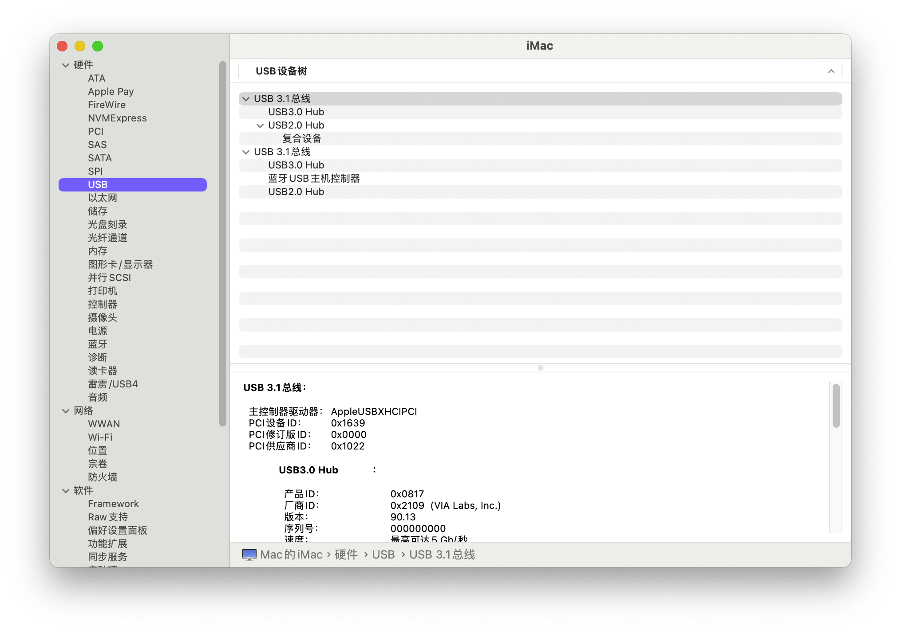
### 处理器
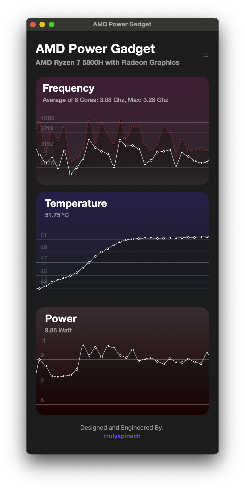
### wifi
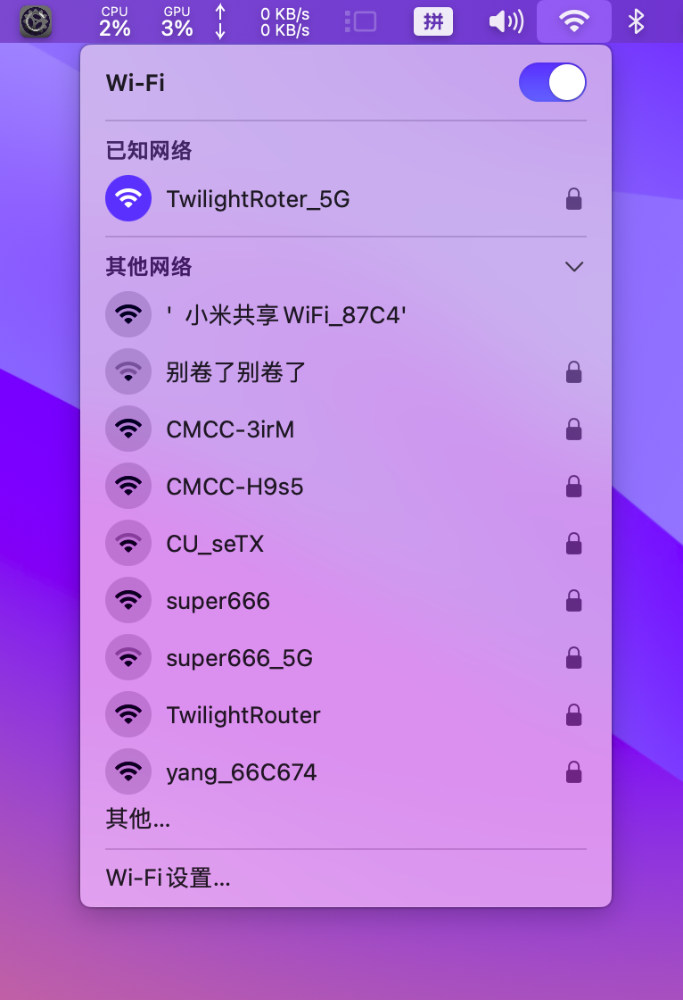

### 显卡
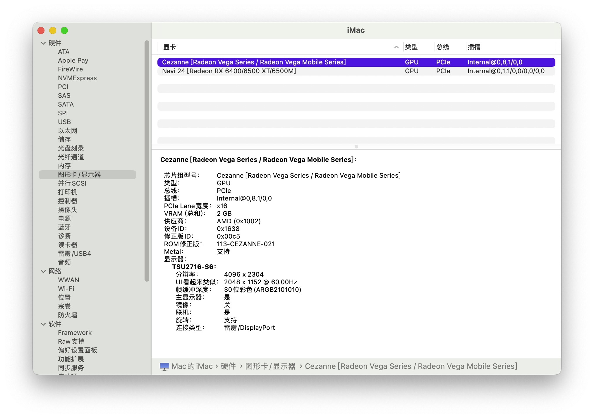
### 内存
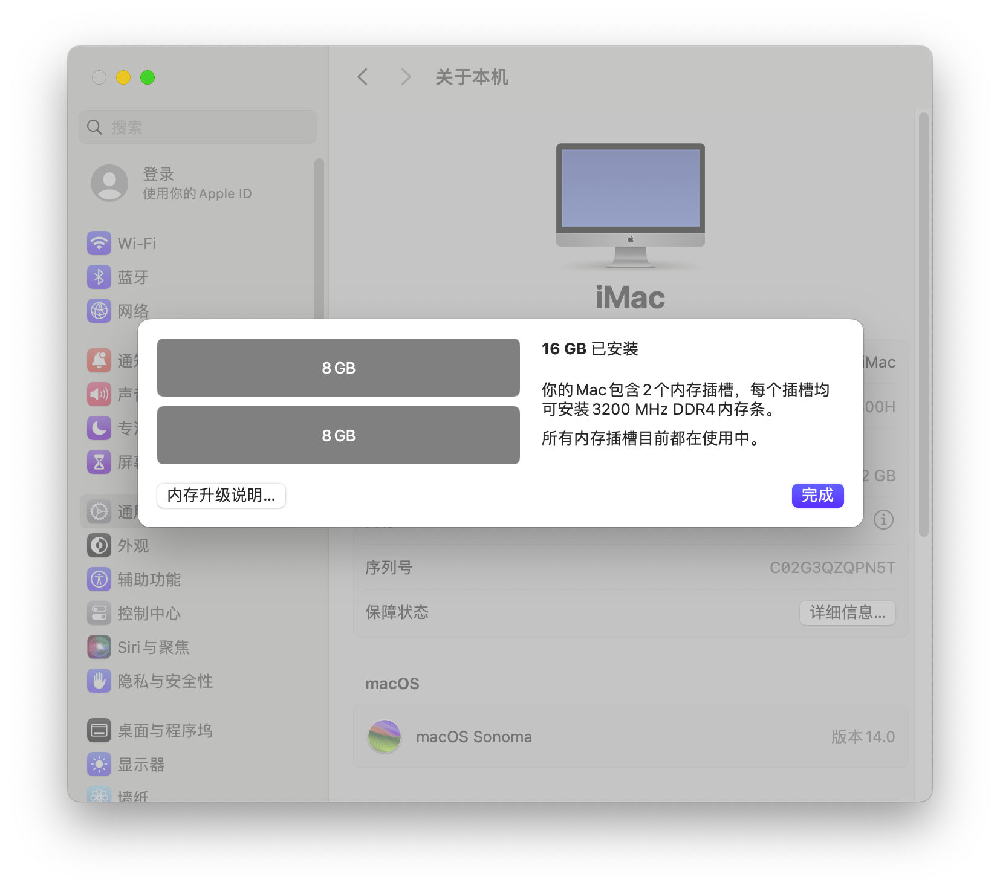
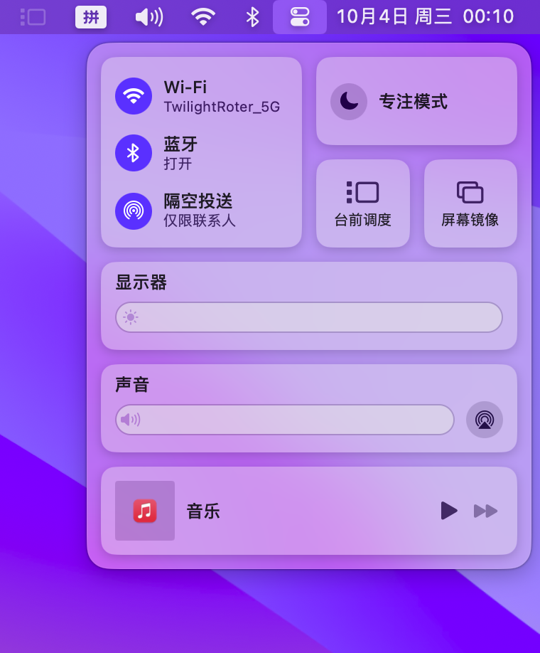

## 参考资料

* [SSDTTime](https://github.com/corpnewt/SSDTTime)
* [Disabling laptop dGPUs (SSDT-dGPU-Off/NoHybGfx)](https://dortania.github.io/Getting-Started-With-ACPI/Laptops/laptop-disable.html)
* [NootedRed](https://github.com/NootInc/NootedRed  )